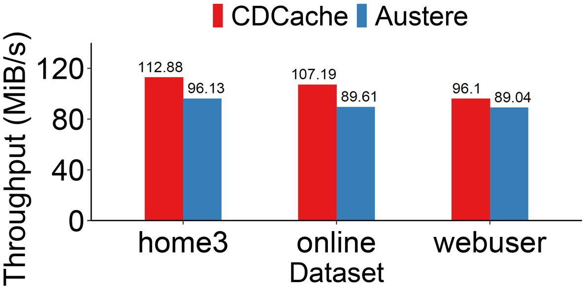

# CDCache
CDCache a space-efficient flash caching system that implements compression-before-deduplication, which applies compression to eliminate byte-level redundancies across data blocks, followed by deduplication on the compressed blocks. You can find more details in our publication.
## Publication
[CDCache: Space-Efficient Flash Caching via Compression-before-Deduplication](#) INFOCOM 2024

## Build & Usage
### Install dependencies

- Follow [xxhash official repository](https://github.com/Cyan4973/xxHash) to install xxhash in your computer

### Build CDCache
Follow the steps below to compile CDCache:
```
mkdir build && cd build
cmake ..
make -j16
```
Please note that the generated binary file is `main_cache_app`, located in the `$project_root$/bin` directory

### Usage

`main_cache_app` receives only one parameter, which specifies the configuration file path. There is a configuration file sample in `json` format in the `xxxx` directory. The parameters in it are as follows:
```json
{
    "dataset_trace_path": "/mnt/d/dataset/fiu/home3.cd.txt",
    "dataset_data_path": "/mnt/d/dataset/vmdk",
    "dataset_block_size": 4096,
    "output_path": "~",
    "cache_size": 70990848,
    "data_block_buffer_size": 8,
    "log_path": "~",
    "run": true,
    "result_path": "result.txt",
    "cache_type": "cdcache"
}
```
- `dataset_trace_path`: the I/O trace file
- `dataset_data_path`: the data file
- `output_path`: Data block granularity in trace
- `output_path`: Used to output some information,  just remain it as `~`, which means no information will be output
- `cache_size`: The size of cache (in Bytes)
- `data_block_buffer_size`: The maximum number of data blocks that can be cached in the internal cache
- `log_path`: Used to output some debug information
- `result_path`:  Evaluation result path, recording detailed evaluation results
- `cache_type`: Cache type, just remain it as `cdcache`

## Trace evaluation

### Prepare traces

Please download the FIU data set file from [](). The following will take home3 in FIU as an example.

### Prepare data files

You can use [lzdgen](https://github.com/jibsen/lzdatagen) to generate or download source code package (or some others) yourself to prepare a large enough data file (the size should be at least the WSS size of the trace). 

###  Dataset preprocessing
In order to map the I/O records in the trace and the data blocks in the data file to each other, the prepared trace and data files need to be preprocessed. The steps are as follows:

1. Generate hash file for data file
```
/path/to/hash_generator [file path] [data_block size] > [hash file]
```
the `/path/to/hash_generator` is in the same directory as main_cache_app

2. Construct mapping between trace file and data file
```
/path/to/trace_generator [hash_file] [block_size] fiu home3 home3.xxxx1.blktrace .... home3.xxx20.blktrace
```
`/path/to/trace_generator` is also located in the same directory as `main_cache_app`. After Constructing, two files with the same name but different suffixes will be generated. `home3.cd.txt` and `home3.austere.txt`, the former is the data set used by CDCache for testing, and the latter is used for testing by Austere.

### Perform Evaluation

Just run it according to the method in the usage section. Fill in the generated `home3.cd.txt` in `data_trace_path`, fill in the path of the prepared data file in `dataset_data_path`, and fill in the others as needed.

### Appendix

Due to time constraints, there is no throughput evaluation in the published paper. We later used the modified LZ4 to replace the LZ77 algorithm in the paper and measured the current throughput, as shown below:




